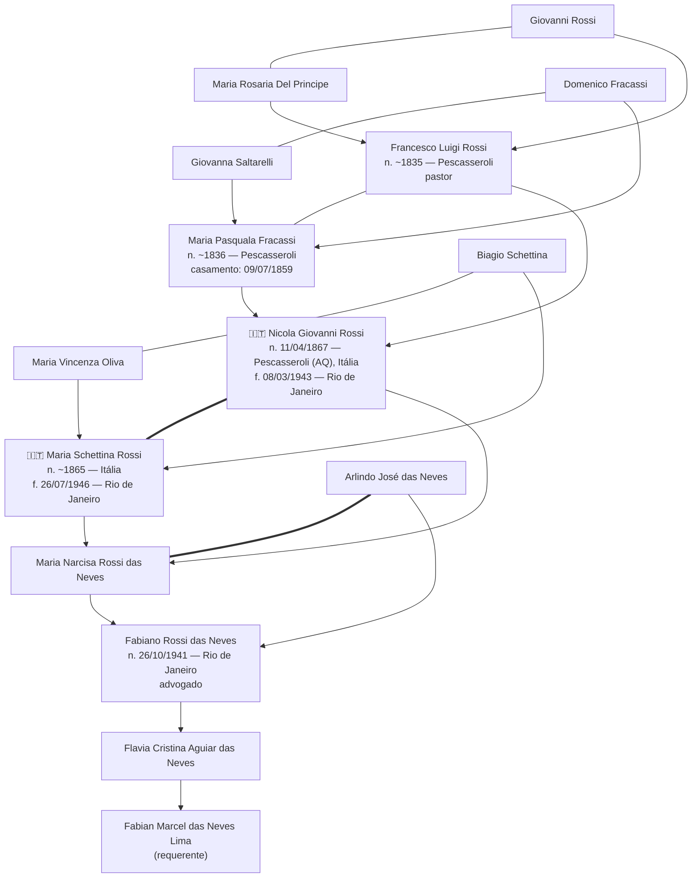

# Árvore Genealógica — Família das Neves / Rossi

Projeto de organização da árvore genealógica de **Fabian Marcel das Neves Lima**,
com foco inicial no **lado materno (Rossi / das Neves)** para fins de
**reconhecimento de cidadania italiana** *jure sanguinis*.

## Linha de transmissão (lado materno)

## Estrutura do repositório

| Arquivo | Conteúdo |
|---|---|
| [`arvore.md`](arvore.md) | Fichas individuais de cada pessoa, com todos os dados extraídos dos documentos |
| [`cidadania-italiana.md`](cidadania-italiana.md) | Análise do caso, checklist de documentos e pendências |
| [`caca-documentos.md`](caca-documentos.md) | Guia prático para localizar cada documento faltante (cartórios, Arquivo Nacional, Portale Antenati, comune) |
| [`documentos/`](documentos/) | Cópias digitais dos documentos já obtidos |

## Resumo do caso

- **Dante causa:** Nicola Giovanni Rossi, nascido em Pescasseroli (L'Aquila, Abruzzo)
  em 11/04/1867 — certidão de nascimento italiana já obtida (atto n. 44).
- **Não naturalização confirmada:** duas certidões negativas do Ministério da Justiça
  (emitidas em 26/03/2026) atestam que Nicola nunca se naturalizou brasileiro.
- **Bônus:** a esposa, Maria Schettina, também era italiana — a linha é
  duplamente italiana na geração imigrante.
- **Geração de transmissão:** Nicola → Maria Narcisa Rossi das Neves (filha) →
  Fabiano Rossi das Neves (neto) → Flavia Cristina Aguiar das Neves (bisneta) →
  Fabian Marcel das Neves Lima (trineto).

> ⚠️ **Atenção:** ver [`cidadania-italiana.md`](cidadania-italiana.md) sobre a
> mudança na lei italiana de 2025 (Lei 74/2025), que impacta diretamente
> pedidos além da 2ª geração, e sobre divergências de nomes entre os documentos.
